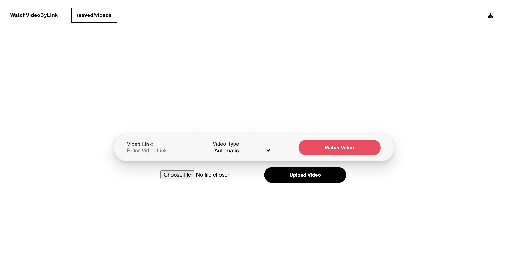
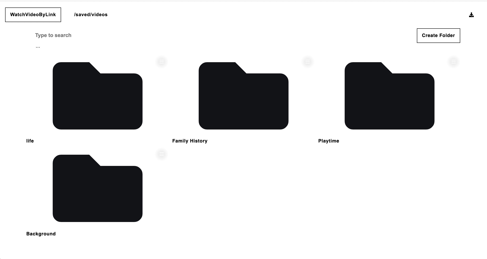
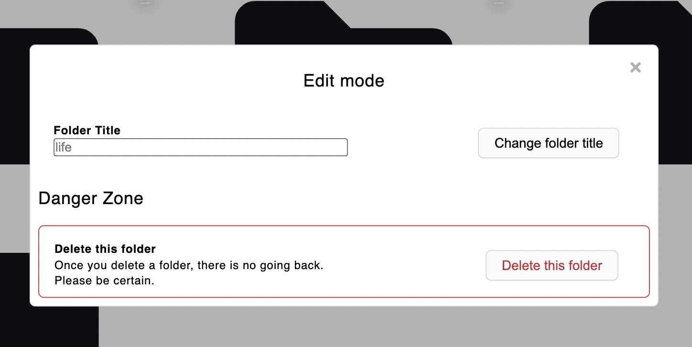
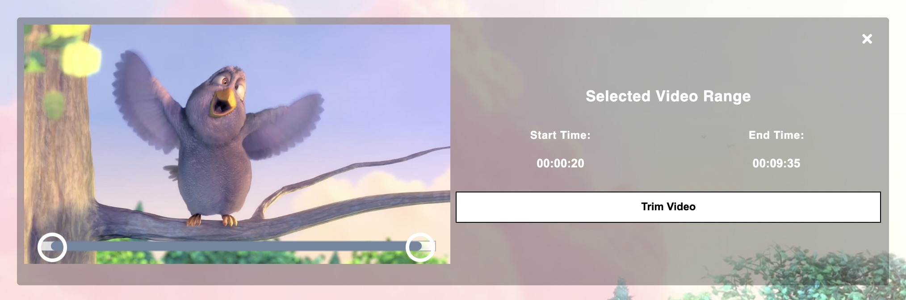

<h1>
  
  <big><strong>WatchVideoByLink</strong></big>
</h1>

WatchVideoByLink takes a public video URL and display it in a video player which has features that make the watching experience an enjoyable process with the ability to Download and Organize MP4/WebM/HLS/MPEG-DASH video types

[**Why WatchVideoByLink?**](#why-watchvideobylink) |
[**Installing Locally Using Docker**](#installing-locally-using-docker) |
[**Installing from Scratch**](#installing-from-scratch) |
[**Contributing**](#contributing) |
[**License**](#license)

## Screenshots & Gifs

**Demo**

<kbd></kbd> 

**Home**

<kbd></kbd>

**/saved/videos**

<kbd></kbd>

<kbd></kbd>

**Video Player**

<kbd></kbd>

**Trim Video**

<kbd></kbd>

## Why WatchVideoByLink?

WatchVideoByLink provides:
- Support for MP4/WebM/HLS/MPEG-DASH video types
- Custom video players for consuming streams and videos
- Automatically detect video files from [supported websites](https://ytdl-org.github.io/youtube-dl/supportedsites.html)
- Download, Trim or Record streams and videos
- Uploading videos max 1GB per file
- Keeping downloaded videos organised with folder creation and file renaming 
- Search functionality to find folders and videos by name (local to selected folder)
- Restoring failed video downloads using untrunc and some luck 

[For more features check out the wiki](https://github.com/MohamedBakoush/WatchVideoByLink/wiki#features)

## Installing Locally Using Docker 

The fastest way to try WatchVideoByLink locally is using Docker on Windows, Linux or Mac OSX computers.

### 1. Install Docker

[Install Docker](https://docs.docker.com/get-docker/) by following Docker’s instructions 

### 2. Clone Github Repository

Clone repo in your terminal with the following commands:

```
git clone https://github.com/MohamedBakoush/WatchVideoByLink.git
```

### 3. Launch Through Docker

Navigate to the folder you created in step 2:

```
cd WatchVideoByLink
```

Then, run the following command:

```
docker build -t watchvideobylink .
docker run -p 8080:8080 watchvideobylink
```

You should see a wall of logging output from the containers being launched on your machine. Once this output slows, you should have a running instance of Superset on your local machine!

## Installing from Scratch

### Requirements to run WatchVideoByLink
  - [Node.js](https://nodejs.org/en/) - Node.js® is a JavaScript runtime built on Chrome's V8 JavaScript engine.
    1. [Download Node.js from https://nodejs.org/en/](https://nodejs.org/en/) 
    2. To check if node.js has been downloaded open command prompt for windows or terminal for macOS/Linux and enter `node -v` this will tell you what version of Node.js has been installed.
  - [Git](https://git-scm.com/) - Git is a free and open source distributed version control system designed to handle everything from small to very large projects with speed and efficiency.
    1. [Download Git from https://git-scm.com/](https://git-scm.com/) 
    2. To check if Git has been downloaded open command prompt for windows or terminal for macOS/Linux and enter `git --version` this will tell you what version of Git has been installed.
### Requirements to unlock additional features
  - [FFmpeg](https://ffmpeg.org/) - A complete, cross-platform solution to record, convert and stream audio and video.
    1. [Download FFmpeg from https://ffmpeg.org/download.html](https://ffmpeg.org/download.html) 
    2. Once FFmpeg has been downloaded drop ffmpeg.exe and ffprobe.exe files (which could be found in ffmpeg\bin folder) in WatchVideoByLink folder.
  - [Untrunc](https://github.com/anthwlock/untrunc) - Restore a damaged (truncated) mp4, m4v, mov, 3gp video. Provided you have a similar not broken video. And some luck.  
    1. [Download Untrunc from https://github.com/anthwlock/untrunc](https://github.com/anthwlock/untrunc) 
    2. Once Untrunc has been downloaded drop all Untrunc files in WatchVideoByLink folder. 
  - **Warning using Untrunc may not achieve desired results**

**For windows: If youtube-dl/Video Type: Automatic dosent work**
  - It may be due to missing MSVCR100.dll File.
    - This can be solved by installing the [Microsoft Visual C++ 2010 Redistributable Package (x86)/(x64)](https://www.microsoft.com/en-us/download/details.aspx?id=26999) from Microsoft Website.

### 1. Clone Github Repository

Clone repo in your terminal with the following command:

```
git clone https://github.com/MohamedBakoush/WatchVideoByLink.git
cd WatchVideoByLink
```

Alternatively you may download and unpack the [zip](https://github.com/MohamedBakoush/WatchVideoByLink/archive/master.zip)

### 2. Install Dependencies

```
npm install
```

### 3. Build necessary tasks

```
npm run build
```

### 4. Start Server

```
npm start
```

Then open `http://localhost:8080` in your preferred browser.

## Contributing
WatchVideoByLink is a free and open source project, and we appreciate any help you're willing to give - whether it's fixing bugs, improving documentation, or suggesting new features. Check out [CONTRIBUTING.md](CONTRIBUTING.md) to find resources around contributing.

<hr/>

<p id="user-content-license" align="center">
  <a href="https://github.com/MohamedBakoush/WatchVideoByLink/blob/master/LICENSE"></a>
</p>
